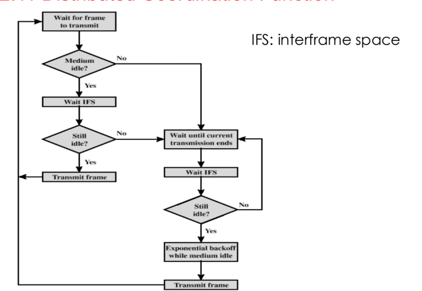

# Classic CSMA/CA

## Basic CSMA/CA

1) Station senses the channel
   1) -> It's clear: waits IFS
   2) -> After IFS medium is busy
   3) -> Waits until medium is clear
   4) -> Medium is clear, wait IFS
   5) -> Enters contention window (Randomized back-off)
   6) -> Next frame
7) If after the first waited IFS the medium is still clear
   8) -> Trasmit